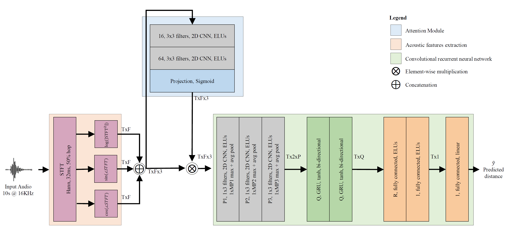

# Speaker Distance Estimation in Enclosures from Single-Channel Audio

## Instructions
Training, validation, and testing of the approach on all scenarios are provided in training_*.py files.

## DATASETS
We provide our synthetic dataset, STARS23, and QMULTIMIT for speaker distance estimation. In addition, training, validation, and testing splits are provided. VoiceHome-2 can be downloaded from <a href="https://zenodo.org/records/1252143" target="_blank">Zenodo</a>

It is possible to download the datasets from the following link: <a href="https://uniroma3-my.sharepoint.com/:f:/g/personal/mneri2_os_uniroma3_it/Er6NW6ngIbxPubpMy5PKeFkBdZqGHUsRb64GOTXMV3fcpQ" target="_blank">Onedrive</a> 

